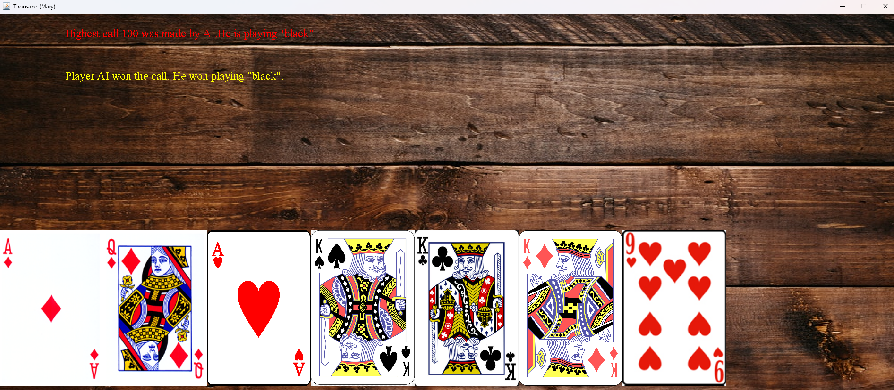
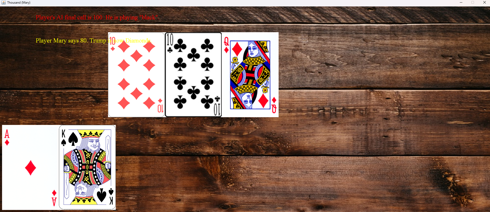
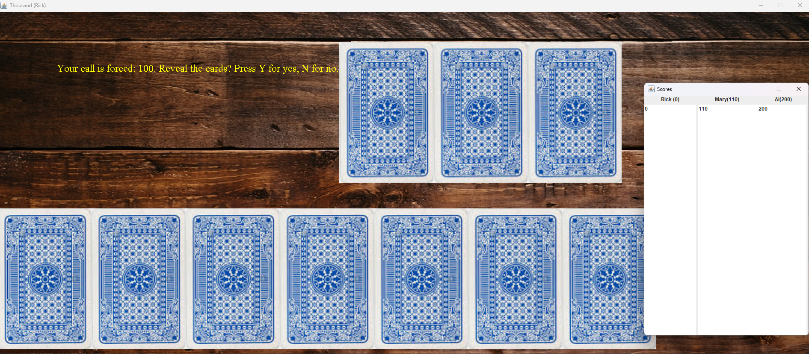

# One Thousand card game

This repo consists of One thousand game server and One thousand game client.

## Gameplay images

### Starting the game

### In the middle of the game

### Start of the new round

## Note
This game is a variant of One Thousand game. Thus it could slightly vary from the traditional One Thousand game. Also the game could lack some of it's features. However, the main gameplay is working.

## Playing the game

To play the game you need to connect to the server via client.
The server is hosted online, however you can download and host it privately.
Checkout [https://github.com/EvalVis/OneThousand/releases/tag/1.0.0](releases) for client and server.

### Hosting the server

1. Make sure you have Java 17 or later installed in your computer.
2. Download the server jar.
3. Execute command: `java -jar <name of the server jar file>.jar <port>`. When the client connects to the server the same port value must be used.
4. If port is not taken the server should start. If port is taken, select another port.

After 3 players join the game will start.

The server supports more than 3 players, however the game does not.
When the forth player joins a new game room will be created. Each room hosts 3 players.

### Joining the server

1. Make sure you have Java 17 or later installed in your computer.
2. Download the client jar.
3. Execute command: `java -jar <name of the client jar file>.jar`.
4. In the pop up window enter:
    1. Your nickname.
    2. Server IP address. If you host the server on the same computer enter `localhost`.
    3. Server port.
    4. Your gmail address.
    Optional, if provided this gmail will be used to send you game images.
    The game automatically captures images as you play.
    5. Your gmail app password. Optional, but required if gmail address entered,
    you will need to generate it if you don't have it. This app password will
    only be sent to gmail SMTP server in order to send you an email.
    6. Press button to connect to the server.

### Online server

If you wish to play in an already setup server, use this IP address: `onethousandserver.fly.dev`.
However, make sure to bring at least two additional players so you don't have to wait.

## Card values
* Ace - 11
* Ten - 10
* King - 4
* Queen - 3
* Jack - 2
* Nine - 0

## Mariage values
* Hearts' king and queen - 100
* Diamonds' king and queen - 80
* Clubs' king and queen - 60
* Spades' king and queen - 40

## Rules and gameplay
At the start of the game, 7 cards are handed to each player and 3 cards and placed on the table upside down. The players will be betting to receive these 3 unknown cards. There is a total of 24 cards (from 9 to Ace). Players cards are also placed upside down, so they can play blindly (in this game it's called "black").
The players can reveal their cards but when they would exit blind mode. Players who play blind have double awards if they win. However, consequences also are increased by double in case of losing. When cards are in place, a random player is selected to start a call. It must call for 100. It can also reveal his card if he does not want to play blindly. The other players going clockwise can raise or fold (in this version you can only raise the amount by 10). They can also reveal their cards to stop playing blindly. When only one player has not folded, it wins the 3 cards. These cards must be shown to the other players (however, if the call phase winner chose to play blindly until the end of the call phase the cards are not shown to others). The player can now look at all 10 cards. He must discard 3. Those cards will participate in the score calculations when all cards are played. The player can when increase it's final bet.
The player who won the bet plays a card first. Other players, going clockwise must play the card of the same type (if they don't have one, they can play any card).
When 3 cards are played, the winner is determined by these rules:

* If there is one trump card it wins, if there are two or three, card values determine the winner.
* If there are two or three cards of first's cards type, the highest value card from this type wins.
* Otherwise, the player who played the card first (who won the last 3 card battle), wins.

The player who wins the 3 card battle gets to play first on the upcoming 3 card battle. Also the winner takes his and the losers cards which were played - they will add up to his score. The first player can set trump type or replace the old one if he has marriage suited pairs. If a king or queen was played earlier without playing first, marriage does not happen and points are not awarded as well as the trump is lost.
When all 21 (7 \* 3) cards are played the score is calculated. All taken cards are summed by their values and marriage values are also applied. If the player failed to fulfill his bet, he loses points: if he bet 100 he will lose 100 (unless the player bet playing blindly then it's 200).
The game goes up to 1000 points.

# Gameplay notes

1. If you will the call 3 additional cards will be revealed.
The card count in your hand must match the card count of other players so you must discard 3 cards.
You can do it by left clicking on them, a red cross will appear on the card.
To cancel selection, press again. When you have 3 cards selected press `Enter` to confirm your choice.
2. After you discard the cards you can increase your betting amount if you wish, yet you cannot decrease it.